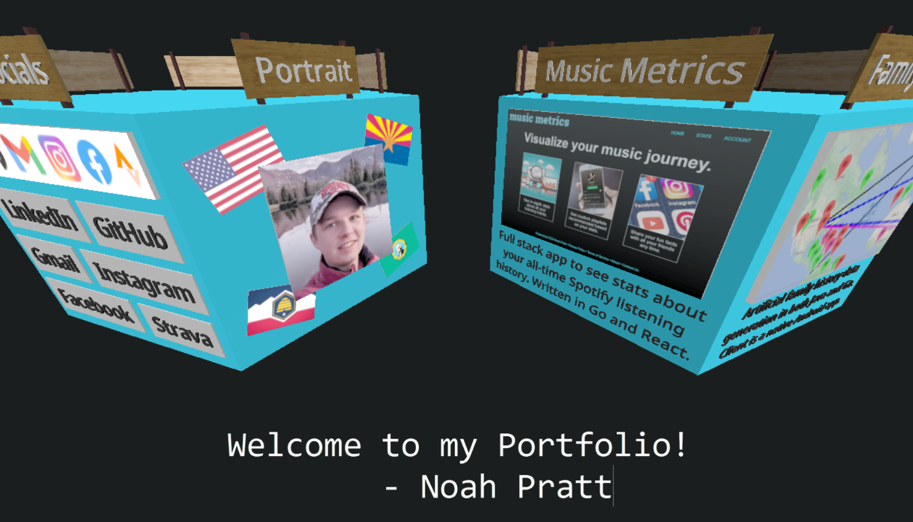

# Welcome, Route 66 Travelers!

Noah Pratt

# Contents
* [Skills](#skills)
* [Projects](#projects)
* [Other repos](#other-public-repos)

# Skills
* Java | Object-oriented programming
* JavaScript | TypeScript | React | Vue | Node.js
* Python | Deep Learning
* Android Apps & Widgets | Kotlin
* SQL | MySQL
* Self-hosting
* 3D Design | CAD Software
* AWS | Microsoft Azure
* Go
* PWAs | Next.js

# Projects

## Music Metrics
#### Repo: Private
#### Website: [musicmetrics.app](https://musicmetrics.app)
A web application that tracks a user's Spotify listening and computes interesting statistics from it. Backend is written in Go, using
MySQL with good database design principles to store listening history as well as song and album metadata.
Frontend uses ReactJS to provide a clean, seamless web UI for users to see their stats among other things.

## Vox Box
#### Repo: [prattnj/vox-box](https://github.com/prattnj/vox-box)
#### Website: not available
A collection of Python applications that allow a user to create a dataset of their own voice, train an AI model with that data, and
use that model to generate vocal samples that mimic their voice. Written in Python using PyTorch, adapts the Tacotron 2 model, and contains
a submodule ([prattnj/tts-dataset](https://github.com/prattnj/tts-dataset)) that is used to create the vocal samples and corresponding datset.

## GoatHouse Pizza
#### Repo: [prattnj/goathousepizza](https://github.com/prattnj/goathousepizza)
#### Website: [goathousepizza.com](https://goathousepizza.com)
A website for a brick oven pizza business that I helped start in 2022. Uses Vanilla JavaScript to provide an ordering platform for
customers, integrating Microsoft Azure Functions along with Google's Calendar API to schedule orders.

## Interactive Portfolio
#### Repo: [prattnj/noahpratt](https://github.com/prattnj/noahpratt)
#### Website: [noahpratt.com](https://noahpratt.com)
A website created as a way to visualize my resume. Uses 3JS to design and render interactive polyhedrons that display information.
Additionally, uses Vite as a JavaScript build tool and other basic development tools like Git.

## Chess Application
#### Repo: Private for academic integrity
#### Website: in development
Created by professors and TA's including myself as a project for the students of a Software Engineering class at BYU. Uses
good software design principles and modern technologies to implement a fully functional chess server and client, both
written in Java. Communication is done via REST API and WebSocket. A web-based client is currently in development. [prattnj/chess2024](https://github.com/prattnj/chess2024)
is a public variation (built for the purpose of testing [softwareconstruction240/autograder](https://github.com/softwareconstruction240/autograder) of the original repo with similar features.

# Other Public Repos (not including forks)
* [fact-fiesta](https://github.com/prattnj/fact-fiesta) - A service written in Go that provides a random fun fact. Includes an Android app written in Kotlin, web UI is in development.
* [tts-dataset](https://github.com/prattnj/tts-dataset) - See [Vox Box](#vox-box) above.
* [tweeter](https://github.com/prattnj/tweeter) - A social media app for Android whose purpose is to demonstrate good software design principles and patterns.
* [fms-go](https://github.com/prattnj/fms-go) - The backend portion of a service that generates articial family history information. Originally written in Java for a software engineering class at BYU, I reimplemented this project to learn the Go language.
* [js-evaluation](https://github.com/prattnj/js-evaluation) - A parser/evaluator of JavaScript written in Go. Only evaluates a subset of the JS language and utilizes the Acorn parser.
* [mm-analytics](https://github.com/mm-analytics) - An Android widget for personal use. Updates are executed periodically that show me various analytics and status updates for [music-metrics](https://github.com/prattnj/music-metrics).
* [wordle](https://github.com/prattnj/wordle) - A collection of programs in Python including Wordle itself, a Wordle solver, and a Wordle bot. Still in development.
* [wordle-bot](https://github.com/prattnj/wordle-bot) - A lightweight Java CLI program that solves Wordle in as few guesses as possible. As of now, it is only mostly functional.
* [gh-hq](https://github.com/prattnj/gh-hq) - A simple static webpage that displays a slideshow of various pictures of my friends and I up to our usual shenanigans.
